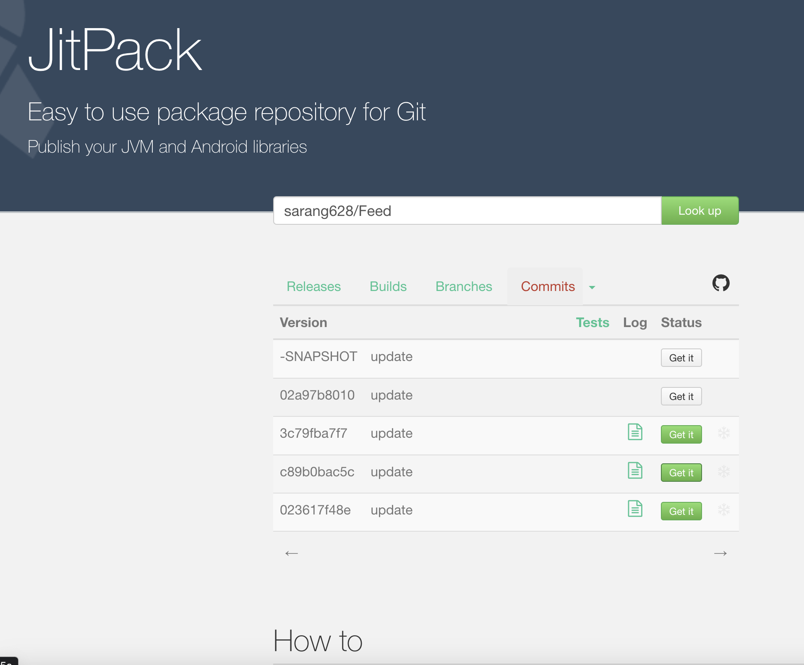
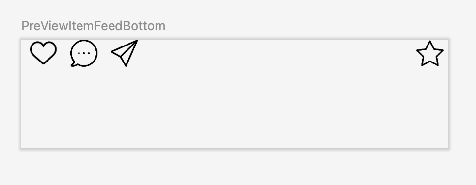

# 피드 화면

피드 화면은 토랑앱에서 사용자가 작성한 리뷰를 리스트로 보여주는 화면입니다.

이 모듈에서 구현하려는 기술들입니다:

* 멀티 모듈 기반 화면 단위 모듈로 개발
* Jetpack Compose 사용
* UIState 활용
* MVVM 아키텍처 적용
* 화면 UnitTest 작성

## 스크린샷


## 특징

### 멀티 모듈 기반 화면 단위 모듈로 개발

Jitpack를 사용하여 이 모듈을 빌드 할 수 있게 적용하였습니다.



아래 3가지 코드를 추가 하면 어떤 프로젝트든지 간단하게 화면을 적용 시킬 수 있습니다.

```
allprojects {
repositories {
...
maven { url 'https://jitpack.io' }
}
}
```

```
dependencies {
implementation 'com.github.sarang628:Feed:02a97b8010'
}
```

```
setContent {
FeedsScreen(feedsViewModel = FeedsViewModel(this))
}
```

### Jetpack Compose 사용

```
@Composable
@Composable
fun ItemFeedComment(
    contents: String? = "",
    likeAmount: Int? = 0,
    author: String? = "",
    comment: String? = "",
    commentAmount: Int? = 0,
    author1: String? = "",
    comment1: String? = "",
    author2: String? = "",
    comment2: String? = ""
) {
    Column(Modifier.padding(start = 8.dp)) {
        if (contents != null)
            Text(text = contents)

        if (likeAmount != null) {
            if (likeAmount > 0)
                Text(text = "좋아요 $likeAmount 개", color = Color.DarkGray)
        }

        if (author != null)
            Row() {
                Text(text = author, fontWeight = FontWeight.Bold)
                Spacer(modifier = Modifier.padding(start = 3.dp))
                Text(text = comment ?: "")
            }

        if (commentAmount != null) {
            if (commentAmount > 0)
                Text(text = "댓글 $commentAmount 개 모두보기", color = Color.DarkGray)
        }

        if (author1 != null)
            Row() {
                Text(text = author1, fontWeight = FontWeight.Bold)
                Spacer(modifier = Modifier.padding(start = 3.dp))
                Text(text = comment1 ?: "")
            }

        if (author2 != null)
            Row() {
                Text(text = author2, fontWeight = FontWeight.Bold)
                Spacer(modifier = Modifier.padding(start = 3.dp))
                Text(text = comment2 ?: "")
            }
    }

}
```


### UIState 활용

### MVVM 아키텍처 적용

### 화면 UnitTest 작성

### Preview