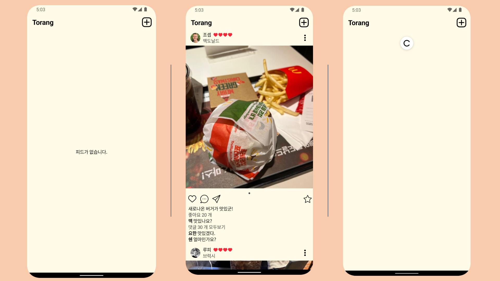

# 피드 화면
피드 화면은 사용자가 작성한 리뷰를 리스트로 보여주는 화면입니다.



# Convention
## package


# Architecture
## UI Layer
UI state
```
data class FeedUiState(
    val isRefreshing: Boolean = false                   // 스크롤 리프레시
    , val list: List<FeedData> = ArrayList()            // 피드 리스트
    , val isExpandMenuBottomSheet: Boolean = false      // 피드메뉴 show 유무
    , val isExpandCommentBottomSheet: Boolean = false   // 커멘트창 show 유무
    , val isShareCommentBottomSheet: Boolean = false    // 공유창 show 유무
    , val isFailedLoadFeed: Boolean = false             // 피드 로딩 실패
    , val selectedReviewId: Int? = null                 // 선택한 리뷰
    , val comments: List<CommentData>? = null           // 커멘트 리스트
    , val myProfileUrl: String? = null                  // 커멘트 하단에 사용할 프로필 url
    , val error: String? = null                         // 에러 메시지
)
```

ViewModel
```
@HiltViewModel
class FeedsViewModel @Inject constructor(
    private val feedService: FeedService
) : ViewModel() {

    // UIState
    private val _uiState = MutableStateFlow(FeedUiState())
    val uiState = _uiState.asStateFlow()

    init {
        viewModelScope.launch {
            feedService.feeds.collect { newData -> _uiState.update { it.copy(list = newData) } } // feed 리스트 수집
            getFeed() // feed 가져오기
        }
    }

    // 피드 리스트 갱신
    fun refreshFeed() {...}

    // 피드 가져오기
    private suspend fun getFeed() {...}

    // 커멘트 가져오기
    fun onComment(reviewId: Int) {...}

    // 공유 클릭
    fun onShare() {...}

    // 즐겨찾기 클릭
    fun onFavorite(reviewId: Int) {...}

    // 좋아여 클릭
    fun onLike(reviewId: Int) {...}

    // 메뉴 닫기
    fun closeMenu() {...}

    // 코멘트창 닫기
    fun closeComment() {...}

    // 공유창 닫기
    fun closeShare() {...}

    // 메뉴 열기
    fun onMenu() {...}

    // 코멘트 작성하기
    fun sendComment(comment: String) {...}

    // 에러메시지 삭제
    fun removeErrorMsg() {...}

}
```


## 멀티 모듈

Jitpack를 사용하여 모듈을 빌드 할 수 있게 적용.


```
allprojects {
repositories {
...
maven { url 'https://jitpack.io' }
}
}
```

```
dependencies {
implementation 'com.github.sarang628:Feed:02a97b8010'
}
```

### Jetpack Compose
```
@AndroidEntryPoint
class MainActivity : ComponentActivity() {

    override fun onCreate(savedInstanceState: Bundle?) {
        super.onCreate(savedInstanceState)

        setContent {
            TorangTheme {
                Column {
                    FeedScreen(
                        clickAddReview = {},
                        onRestaurant = {},
                        onName = {},
                        onImage = {},
                        onProfile = {},
                        ratingBar = { RatingBar(rating = it) }
                    )
                }
            }
        }

    }
}
```

Hilt
```
/**
 * Domain Layer
 * DataLayer와 UILayer을 연결
 */
@InstallIn(SingletonComponent::class)
@Module
class FeedServiceModule {
    @Provides
    fun provideFeedService(
        feedRepository: FeedRepository
    ): FeedService {
        return object : FeedService {
            override suspend fun getFeeds() {
                feedRepository.loadFeed()
            }

            override val feeds: Flow<List<FeedData>>
                get() = feedRepository.feeds.map { it ->
                    it.stream().map {
                        it.toFeedData()
                    }.toList()
                }

            override suspend fun addLike(reviewId: Int) {
                feedRepository.addLike(reviewId)
            }

            override suspend fun deleteLike(reviewId: Int) {
                feedRepository.deleteLike(reviewId)
            }

            override suspend fun deleteFavorite(reviewId: Int) {
                feedRepository.deleteFavorite(reviewId)
            }

            override suspend fun addFavorite(reviewId: Int) {
                feedRepository.addFavorite(reviewId)
            }

            override suspend fun getComment(reviewId: Int): CommentDataUiState {
                val result = feedRepository.getComment(reviewId)
                return CommentDataUiState(
                    myProfileUrl = result.profilePicUrl,
                    commentList = result.list.stream().map { it.toCommentData() }.toList()
                )
            }

            override suspend fun addComment(reviewId: Int, comment: String) {
                feedRepository.addComment(reviewId, comment)
            }
        }
    }
}
```

### 화면 UnitTest 작성

### Preview