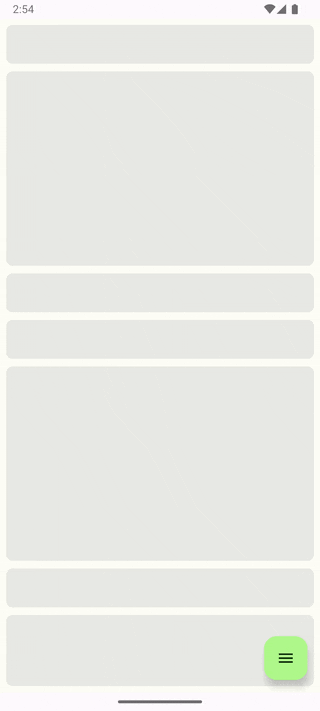

# Feed Module

피드(feed): 스크롤해서 볼 수 있는 콘텐츠 스트림

[Introduce.md](./docs/Introduce.md)

## Jitpack 설정

settings.gradle.kts

```
dependencyResolutionManagement {
    repositoriesMode.set(RepositoriesMode.FAIL_ON_PROJECT_REPOS)
    repositories {
        google()
        mavenCentral()
        maven("https://jitpack.io") -- 추가
    }
}
```

build.gradle.kts

```
dependencies {
    implementation ("com.github.sarang628:Feed:17428f3a58") -- 추가
}
```

https://jitpack.io/#sarang628/Feed 에서 최신(커밋 해시) 버전 확인

## Empty


```
@OptIn(ExperimentalMaterial3Api::class)
@Preview(showBackground = true)
@Composable
fun FeedScreenEmptyPreview() {
    FeedScreen(uiState = FeedUiState.Empty)
}
```

## Loading


```
@OptIn(ExperimentalMaterial3Api::class)
@Preview(showBackground = true)
@Composable
fun FeedScreenLoadingPreview() {
    FeedScreen(uiState = FeedUiState.Loading)
}
```

## Loading Success



```
@OptIn(ExperimentalMaterial3Api::class)
@Preview(backgroundColor = 0xFFFDFDF6, showBackground = true)
@Composable
fun FeedScreenSuccessPreview() {
    FeedScreen(/*Preview*/
        uiState = FeedUiState.Success(
            list = listOf(
                Feed.Sample, Feed.Sample, Feed.Sample, Feed.Sample, Feed.Sample, Feed.Sample, Feed.Empty, Feed.Empty, Feed.Empty, Feed.Empty, Feed.Empty, Feed.Empty, Feed.Empty, Feed.Empty, Feed.Empty
            )
        )
    )
}
```