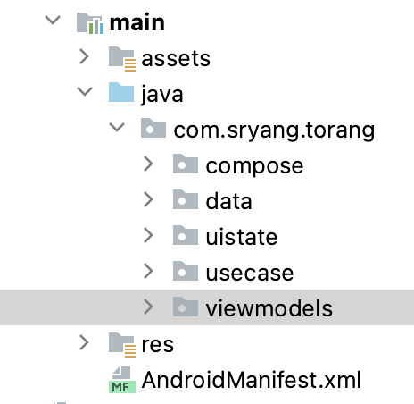

# 피드 화면
피드 화면은 사용자가 작성한 리뷰를 리스트로 보여주는 화면입니다.


## Convention
### package



## case
- 피드를 로드 후 피드가 없으면 비어있음 표시
- 좋아요 추가하기
- 즐겨찾기 추가하기
- 피드 불러오기


## Architecture
### UI Layer
UI state
```
data class FeedUiState(
    val isRefreshing: Boolean = false       // 스크롤 리프레시
    , val list: List<FeedData> = listOf()   // 피드 리스트
    , val faliedLoad: Boolean = false       // 피드 로딩 실패
    , val error: String? = null             // 에러 메시지
)
```

ViewModel
```
@HiltViewModel
class FeedsViewModel @Inject constructor(
    private val feedRefreshUseCase: FeedRefreshUseCase,
    private val addLikeUseCase: AddLikeUseCase,
    private val deleteLikeUseCase: DeleteLikeUseCase,
    private val addFavoriteUseCase: AddFavoriteUseCase,
    private val deleteFavoriteUseCase: DeleteFavoriteUseCase,
    private val getFeedFlowUseCase: GetFeedFlowUseCase
) : ViewModel() {

    // UIState
    private val _uiState = MutableStateFlow(FeedUiState())
    val uiState = _uiState.asStateFlow()

    init {
        viewModelScope.launch {
            feedService.feeds.collect { newData -> _uiState.update { it.copy(list = newData) } } // feed 리스트 수집
            getFeed() // feed 가져오기
        }
    }

    // 피드 리스트 갱신
    fun refreshFeed() {...}

    // 피드 가져오기
    private suspend fun getFeed() {...}

    // 에러메시지 삭제
    fun removeErrorMsg() {...}
    
    // 즐겨찾기 클릭
    fun onFavorite(reviewId: Int) {...}
    
    // 좋아여 클릭
    fun onLike(reviewId: Int) {...}
}
```

## UnitTest
like가 1개 이상이면 갯수를 표시 한다.
comment가 1개 이상이면 코멘트 갯수를 표시 한다.


## Preview
