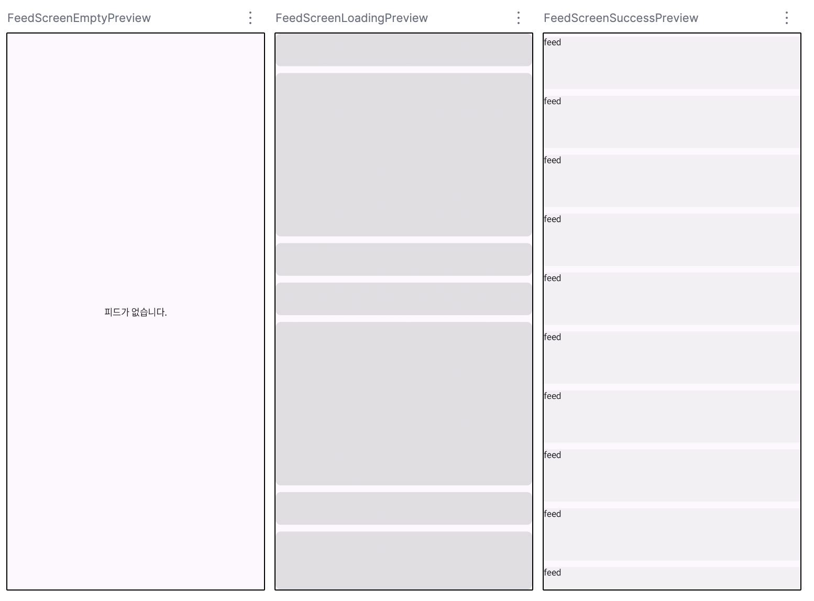

# Feed Module



피드(feed): 스크롤해서 볼 수 있는 콘텐츠 스트림

[Introduce.md](./docs/Introduce.md)

## 환경

### 테스트 환경

Android Studio Meerkat | 2024.3.1 Patch 1<br>
gradle-8.11.1-bin
Gradle JDK: corretto-17.0.14
minSdk: 26

### Jitpack 설정

settings.gradle.kts

```
dependencyResolutionManagement {
    repositoriesMode.set(RepositoriesMode.FAIL_ON_PROJECT_REPOS)
    repositories {
        google()
        mavenCentral()
        maven("https://jitpack.io") -- 추가
    }
}
```

build.gradle.kts

```
dependencies {

    implementation(libs.androidx.core.ktx)
    implementation(libs.androidx.lifecycle.runtime.ktx)
    implementation(libs.androidx.activity.compose)
    implementation(platform(libs.androidx.compose.bom))
    implementation(libs.androidx.ui)
    implementation(libs.androidx.ui.graphics)
    implementation(libs.androidx.ui.tooling.preview)
    implementation(libs.androidx.material3)
    testImplementation(libs.junit)
    androidTestImplementation(libs.androidx.junit)
    androidTestImplementation(libs.androidx.espresso.core)
    androidTestImplementation(platform(libs.androidx.compose.bom))
    androidTestImplementation(libs.androidx.ui.test.junit4)
    debugImplementation(libs.androidx.ui.tooling)
    debugImplementation(libs.androidx.ui.test.manifest)

    implementation ("com.github.sarang628:Feed:17428f3a58") -- 추가
}
```

https://jitpack.io/#sarang628/Feed 에서 최신(커밋 해시) 버전 확인

## 사용

피드 빈 상태

```
@OptIn(ExperimentalMaterial3Api::class)
@Preview(showBackground = true)
@Composable
fun FeedScreenEmptyPreview() {
    FeedScreen(uiState = FeedUiState.Empty)
}
```

로딩 상태

```
@OptIn(ExperimentalMaterial3Api::class)
@Preview(showBackground = true)
@Composable
fun FeedScreenLoadingPreview() {
    FeedScreen(uiState = FeedUiState.Loading)
}
```

데이터 로딩에 성공 상태

```
@OptIn(ExperimentalMaterial3Api::class)
@Preview(showBackground = true)
@Composable
fun FeedScreenSuccessPreview() {
    FeedScreen(
        //@formatter:off
        uiState = FeedUiState.Success(list = listOf(Feed.Empty, Feed.Empty, Feed.Empty, Feed.Empty, Feed.Empty, Feed.Empty, Feed.Empty, Feed.Empty, Feed.Empty, Feed.Empty, Feed.Empty, Feed.Empty, Feed.Empty, Feed.Empty, Feed.Empty)),
        //@formatter:on
        feed = {
            Box(
                Modifier
                    .fillMaxWidth()
                    .padding(vertical = 5.dp)
                    .background(Color(0xAAEEEEEE))
                    .height(80.dp)
            ) { Text("feed") }
        }
    )
}
```
