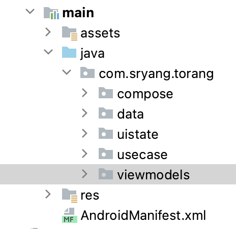
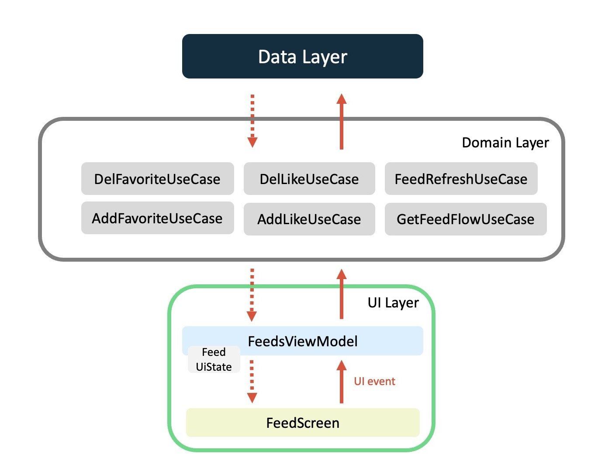
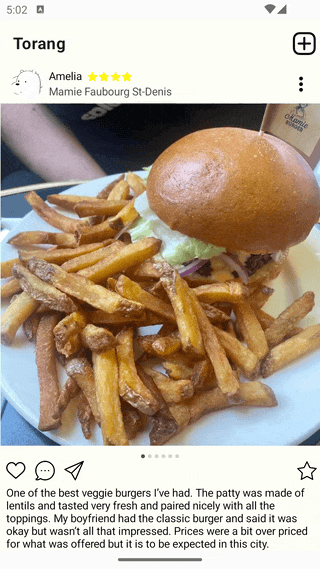

# Feed Module

## 피드 리스트 모듈을 만든 이유
BaseFeed라는 Feed 항목 UI를 제공하는 모듈이 있음.<br>
BaseFeed를 필요한 화면에서 리스트로 만들어 사용하려고 했는데,<br>
리스트에 공통으로 당기면 새로고침, 스크롤 시 새로운 항목 불러오기, 수많은 동일한 이벤트 항목들로<br>

피드를 제공하는 화면마다 위와 같은 기능들을 적용하기 어려움.

BaseFeed 모듈에 Feed 리스트 까지 추가 하려니 BaseFeed 모듈에 구현할 양이 많아져 분리하기로 결정.

## Feature
- 피드 항목을 리스트로 표시
- 스크롤 갱신, 스크롤 로딩 기능 제공


## Convention

### package 구조



### Function 명

- Feed + Screen
- Feed + ViewModel
- GetFeed + UseCase

## UseCase

- 즐겨찾기 추가 AddFavoriteUseCase
- 좋아요 추가 AddLikeUseCase
- 즐겨찾기 삭제 DeleteFavoriteUseCase
- 좋아요 삭제 DeleteLikeUseCase
- 피드 갱신 FeedRefreshUseCase
- 피드 페이징 FeedWithPageUseCase
- 식당 ID에 해당 모든 피드 GetFeedByRestaurantIdFlowUseCase
- 리뷰 ID의 사용자 모든 피드 GetFeedByReviewIdUseCase
- 피드 불러오기 GetFeedFlowUseCase
- 내 피드 가져오기 GetMyFeedFlowUseCase
- 

## Architecture

### UI Layer

#### UI element

UI elements such as activities and fragments that display the data

```
@OptIn(ExperimentalMaterial3Api::class)
@Composable
fun FeedScreen(
    uiState: FeedUiState,           /* ui state */
    clickAddReview: (() -> Unit),   /* click add review */
    feeds: @Composable () -> Unit,  /* feed list ui module(common) */
    consumeErrorMessage: () -> Unit /* consume error message */
) {
    val snackbarHostState = remember { SnackbarHostState() }
    val interactionSource = remember { MutableInteractionSource() }

    // snackbar process
    LaunchedEffect(key1 = uiState.error, block = {
        uiState.error?.let {
            snackbarHostState.showSnackbar(it, duration = SnackbarDuration.Short)
            consumeErrorMessage.invoke()
        }
    })

    // snackbar + topAppBar + feedList
    Scaffold(
        snackbarHost = {
            SnackbarHost(hostState = snackbarHostState)
        },
        topBar = {
            TopAppBar(
                title = { Text(text = "Torang", fontSize = 21.sp, fontWeight = FontWeight.Bold) },
                actions = {
                    Image(painter = painterResource(id = R.drawable.ic_add),
                        contentDescription = "",
                        modifier = Modifier
                            .size(32.dp)
                            .clickable(
                                indication = null,
                                interactionSource = interactionSource
                            ) {
                                clickAddReview.invoke()
                            })
                })
        }) { paddingValues ->
        Box(modifier = Modifier.padding(paddingValues))
        {
            feeds.invoke()
        }
    }
}
```

#### UI state

The UI state is what the app says they should see.

```
data class FeedUiState(
    val isRefreshing: Boolean = false       // 스크롤 리프레시
    , val list: List<FeedData> = listOf()   // 피드 리스트
    , val faliedLoad: Boolean = false       // 피드 로딩 실패
    , val error: String? = null             // 에러 메시지
)
```

#### State holder(ViewModel)

Responsible for the production of UI state and contain the necessary logic for that task

```
@HiltViewModel
class FeedsViewModel @Inject constructor(
    private val feedRefreshUseCase: FeedRefreshUseCase,
    private val addLikeUseCase: AddLikeUseCase,
    private val deleteLikeUseCase: DeleteLikeUseCase,
    private val addFavoriteUseCase: AddFavoriteUseCase,
    private val deleteFavoriteUseCase: DeleteFavoriteUseCase,
    private val getFeedFlowUseCase: GetFeedFlowUseCase
) : ViewModel() {

    // UIState
    private val _uiState = MutableStateFlow(FeedUiState())
    val uiState = _uiState.asStateFlow()

    init {
        viewModelScope.launch {
            feedService.feeds.collect { newData -> _uiState.update { it.copy(list = newData) } } // feed 리스트 수집
            getFeed() // feed 가져오기
        }
    }

    // 피드 리스트 갱신
    fun refreshFeed() {...}

    // 피드 가져오기
    private suspend fun getFeed() {...}

    // 에러메시지 삭제
    fun removeErrorMsg() {...}
    
    // 즐겨찾기 클릭
    fun onFavorite(reviewId: Int) {...}
    
    // 좋아여 클릭
    fun onLike(reviewId: Int) {...}
}
```

## Illustrating cycle of event



## UnitTest

like가 1개 이상이면 갯수를 표시 한다.
comment가 1개 이상이면 코멘트 갯수를 표시 한다.

## What was difficult

- 유닛코드 테스트 작성 어려움(현재 진행중)
    - 명제와 진리표 등을 작성해서 코드로 옮겨야 함.
    - 테스트 라이브러리 학습 필요.
- 피드 리스트 공통 모듈작업
    - 피드 리스트는 프로필 화면 음식점 상세화면 등에도 사용하여 공통 모듈로 작업 필요.
    - 공통 모듈의 라이브러리 의존성을 추가하지 않고 주입하는 방법을 사용
    - 의존성 없이 공통 모듈을 주입하는데 여러 추가 작업이 필요 했음.
    - 이게 맞는 방법인지 잘 모르겠음.

## Preview

